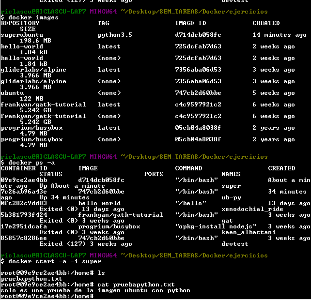
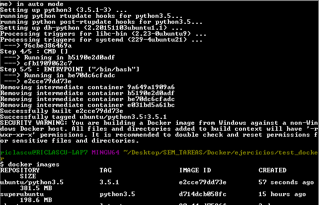
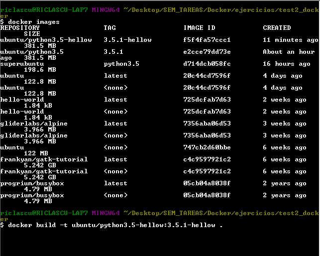

# Ejercicios Sesion1: __Programming for DS__

## Ejercicios: Dockerfile DIY

Crea una imagen de ubuntu con python 3.5 de dos maneras distintas

A partir de un contenedor, usando docker commit

A partir de un Dockerfile, usando docker build

* Ricardo Lastra 

* 160167

**Imagenes:**

