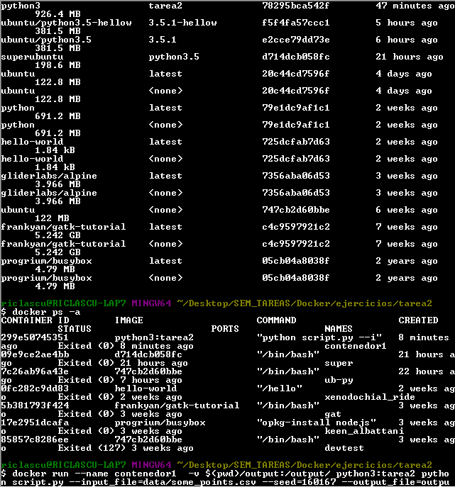

# Tarea 8: __Programming for DS__
## Docker Tarea 2

`Correr scripts`

**Archivos:**

   Dockerfile
   
   requirements.txt
   
   script.py
   
   output/plot.png
   
   data/some_points.csv
   

**Ejecucion exitosa**   

* Ricardo Lastra 

* 160167
