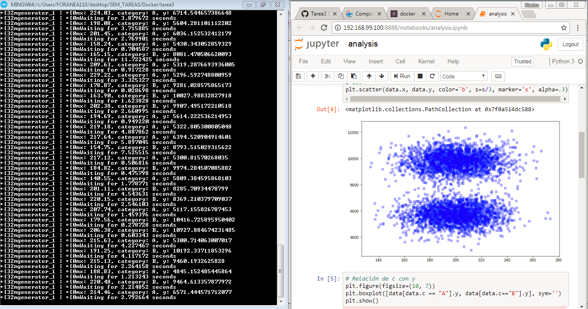

# Tarea 9: __Programming for DS__
## Docker Tarea 3

`Docker Compose`

**Archivos:**

   docker-compose.yaml
   
   Dockerfiles(x3):
   
      Dockerfile
      
      Dockerfile-gen
      
      Dockerfile-con
   
   requirements.txt
   
   consumer.py
   
   generator.py
   
   notebooks/analysis.ipynb
   
   notebook_config/jupyter_notebook_config.py
   
Nota. 
El notebook se abre en el navegador de Windows en: `http://192.168.99.100:8888` y en Linux en: `http://0.0.0.0:8888`

**Ejecucion exitosa**   

* Ricardo Lastra 

* 160167
